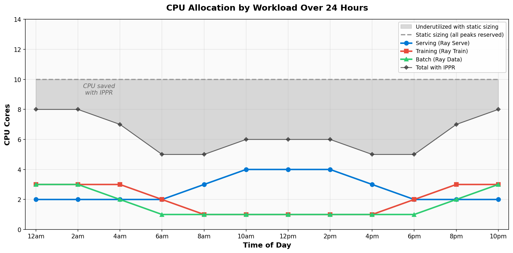

# Vertical autoscaling for multi-tenant Ray on AKS with IPPR

Ray is one of the most widely adopted frameworks for distributed AI/ML workloads especially on AKS. As organizations scale their ML platforms, a common problem emerges where multiple teams sharing an AKS cluster for multitenant needs (serving, training, and batch inference) each have different resource needs that change throughout the day.

With [in-place pod resize](https://kubernetes.io/blog/2025/05/16/kubernetes-v1-33-in-place-pod-resize-beta/) now GA in Kubernetes 1.35, we are integrating vertical scaling capabilities into the Ray Autoscaler v2 for KubeRay on AKS. By scaling pods vertically before scaling horizontally, IPPR enables multi-tenant clusters to run the same workloads on fewer nodes with higher utilization.

## The cost of static sizing on AKS

ML workloads on AKS have a well-known inefficiency: pods must be sized for peak demand at creation and hold those resources for their entire lifetime. On a typical multi-tenant cluster running Ray Serve, Ray Train, and Ray Data, this means a significant portion of reserved compute sits idle — workloads rarely sustain peak demand continuously, but their resource allocations do.

The challenge is that traditional approaches to improving utilization each carry tradeoffs that outweigh the potential savings:

- **Pod restarts** when resizing containers drop live connections on Ray Serve endpoints and lose in-progress training state.
- **Horizontal scaling** with new pods takes 30–60 seconds for scheduling, image pulls, and Ray cluster membership — too slow for real-time serving spikes.
- **Manual coordination** between teams to share capacity doesn't scale beyond a handful of workloads.
- **Adding more nodes** increases cost rather than reducing it.

These tradeoffs mean that improvements in utilization go unrealized — not because they are small, but because the path to achieving them has been too disruptive. In-place pod resize removes that barrier entirely.

## How IPPR improves multi-tenant Ray on AKS

In-place pod resize (IPPR) enables the Ray Autoscaler v2 to dynamically adjust a pod's CPU and memory allocation without restarting the container. This unlocks vertical scaling as a first-class capability alongside the existing horizontal scaling in Ray.

On multi-tenant AKS clusters, serving and training workloads have naturally complementary resource patterns. Serving demand peaks during business hours and drops overnight, while training and batch workloads fill the inverse pattern. IPPR lets the cluster exploit this relationship:

Without IPPR, each workload reserves its peak around the clock — Serving at 16, Training at 10, Batch at 8 — totaling 34 CPU no matter the time. With IPPR, each line rises and falls independently: Serving scales up during business hours, Training spikes during compute phases, and Batch fills in overnight. The shaded region is the gap between what static sizing pays for and what the cluster actually needs.

Using [Standard_D8s_v3](https://azure.microsoft.com/en-us/pricing/details/virtual-machines/linux/) nodes (8 vCPU, 32 GiB, ~$280/month each) as an example, static sizing requires 5 nodes to cover 34 CPU of peak reservations (~$1,402/month). With IPPR, the cluster peaks at 24 CPU and fits on 3 nodes (~$841/month) — a savings of ~$561/month by letting resource allocation track demand instead of worst-case planning. For an enterprise running dozens of multi-tenant Ray clusters across development, staging, and production environments, those per-cluster savings compound into meaningful reductions in monthly AKS spend.

### Faster task scheduling through vertical scale-up

When the Ray Autoscaler detects pending tasks that cannot be placed on existing capacity, it can resize IPPR-enabled pods in seconds — significantly faster than the minutes required to provision a new AKS node. This is particularly impactful for serving workloads where traffic spikes are immediate and latency-sensitive.

### Improved bin-packing and resource utilization

IPPR-enabled pods start with smaller resource requests, allowing the Kubernetes scheduler to bin-pack more pods onto existing nodes. As workload demand grows, pods scale up in-place using available node capacity. This reduces fragmentation and improves overall node utilization compared to static sizing.

### Zero-disruption resizing for stateful workloads

Unlike pod restarts or rolling updates, IPPR resizes containers without interrupting running processes. For Ray workloads, this means:

- **Ray Serve**: No dropped connections during resize. Inference endpoints remain available throughout scaling events.
- **Ray Train**: No lost training progress. Models mid-epoch retain their checkpoints and continue without interruption.
- **Ray Data**: No broken pipeline stages. Batch jobs reading from Azure Blob Storage maintain their I/O state.

### Reduced node count through smarter capacity planning

When new worker pods are needed for IPPR-enabled groups, the autoscaler considers their maximum capacity during bin-packing decisions. A single new AKS node can host a pod that starts small and grows into its allocation, rather than requiring a node large enough for peak demand from the start.

## Looking Ahead

By enabling the Ray Autoscaler v2 to vertically scale pods without restarting containers, IPPR lets serving, training, and batch workloads share cluster resources dynamically by starting small and growing only when demand requires it, and freeing capacity when ephemeral jobs complete. The result is fewer AKS nodes, higher utilization, and zero disruption to running workloads.

As IPPR in KubeRay matures with capabilities like proactive downsizing (automatically shrinking pods when demand drops) and gradual resizing (stepping through intermediate allocations rather than jumping to max), new feature work will continue to unlock new ways for Kubernetes to deliver more efficient infrastructure for your AI/ML needs.

To learn more about Ray on Kubernetes, see the [KubeRay documentation](https://docs.ray.io/en/latest/cluster/kubernetes/index.html). To follow the IPPR implementation, see [PR #55961](https://github.com/ray-project/ray/pull/55961).

